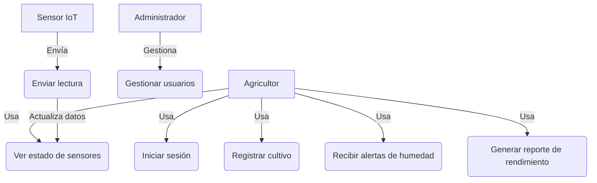
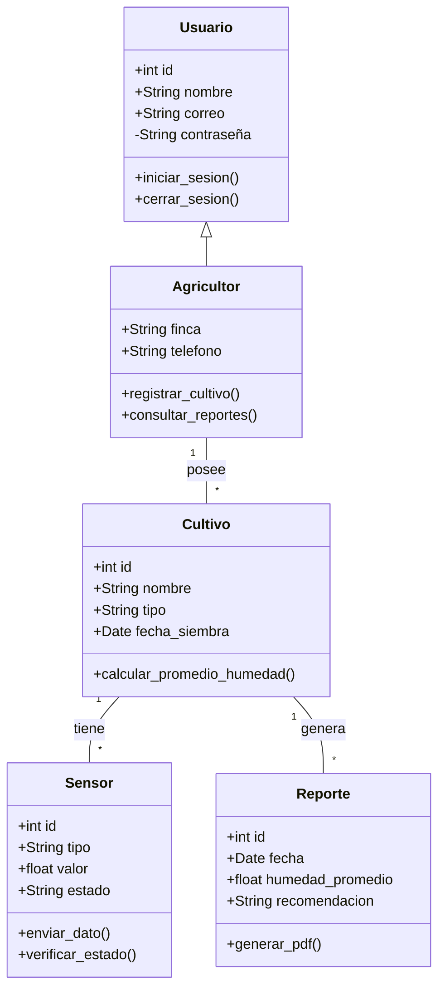
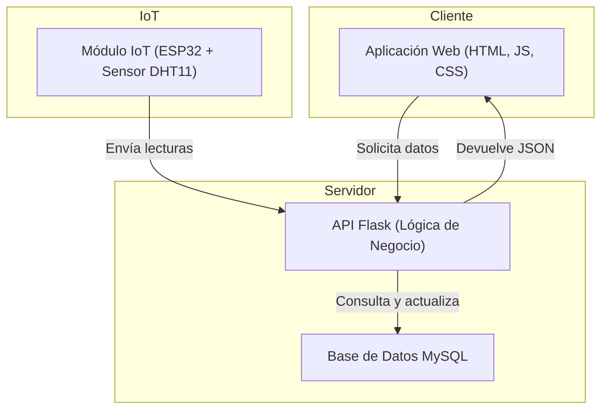
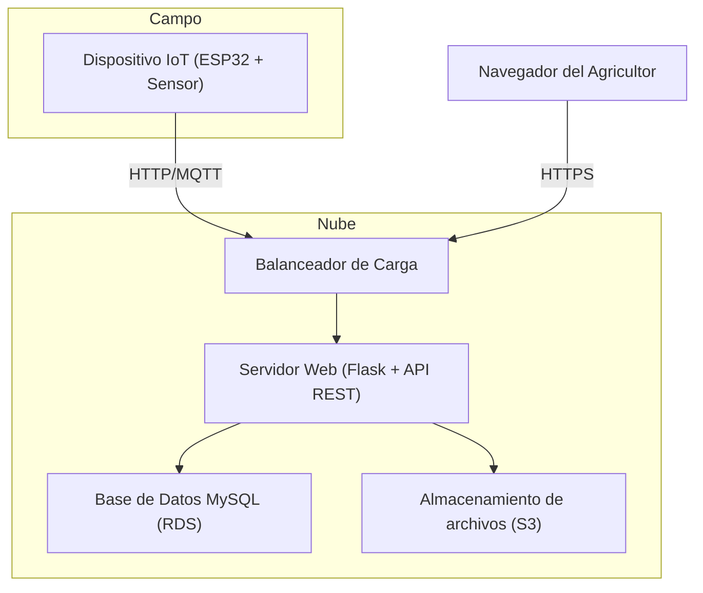
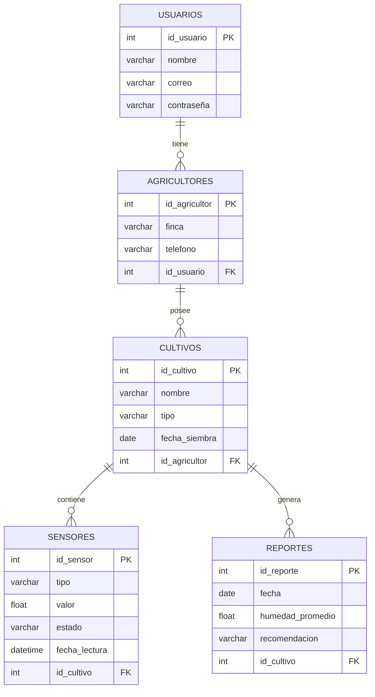

# Diagrama de Casos de Uso – Sistema AgroSmart 

# Diagrama de Clases UML – Sistema AgroSmart

# Diagrama de Componentes – Arquitectura del Sistema AgroSmart

# Diagrama de Despliegue – Infraestructura del Sistema AgroSmart

# Modelo Entidad–Relación (ER) – Base de Datos AgroSmart

